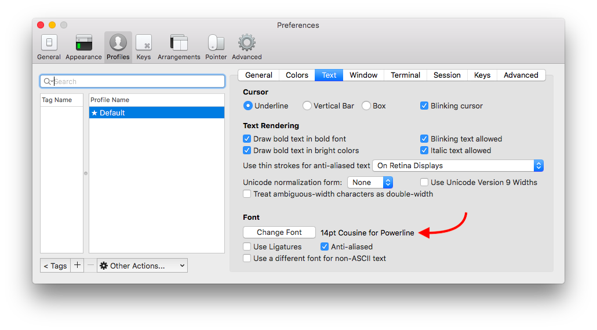

# ZSH

This theme is based on the [agnoster](https://github.com/agnoster/agnoster-zsh-theme) theme and using [oh my ZSH](https://github.com/robbyrussell/oh-my-zsh) for orchestration.

### Install

* `git clone git@github.com:aichholzer/zsh.git`
* `cd zsh && ./install.sh`
* Follow the prompts (if any)
* Enjoy!

**Note:** The required [Powerline](https://github.com/powerline/fonts) fonts are already installed. However, if you are using [iTerm2](https://www.iterm2.com/) you might need to set the font manually to any of them.

* My preferred font at the moment is; `Meslo LG M DZ for Powerline`, `bold` & size `13`.
